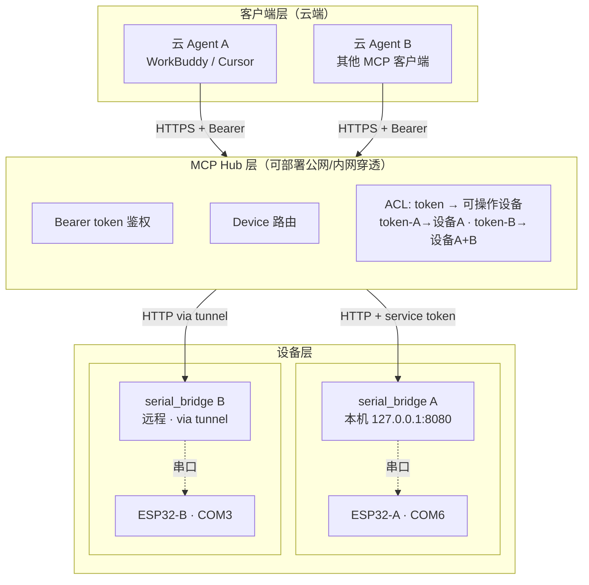

# ESP32 Serial Bridge — 远程接入与多设备架构设计

> **版本**：v1.1（阶段 1 已实现）
> **日期**：2026-07-04
> **状态**：阶段 1 已实现并测试通过；阶段 2/3 待实现
> **关联文档**：[architecture.md](./architecture.md) · [api-reference.md](./api-reference.md)
>
> **维护说明**：本文档是远程接入能力的架构设计稿。实现时按第 8 节的分阶段路线执行，
> 每完成一个阶段更新对应小节的状态标记，并在 architecture.md 的变更记录追加一行。

---

## 1. 背景与目标

### 1.1 当前限制

现有 `mcp_server.py` 使用 stdio transport，只能被本地 agent 通过 spawn 进程接入。
这带来三个限制：

1. **云 agent 无法接入** — 云端智能体（部署在服务器的 agent 运行时）不能 spawn 本地进程
2. **单设备** — 一个 mcp_server 只连一个 serial_bridge，无法操作多台 ESP32
3. **无鉴权** — 本地 stdio 不需要鉴权，但一旦暴露到网络，任何能连上的人都能操作设备

### 1.2 目标场景

| 场景 | 描述 |
|---|---|
| **云 agent 操作本机设备** | WorkBuddy/Cursor 等云端 agent 通过 HTTP 接入，操作本机 ESP32 |
| **多设备管理** | 一个 Hub 管理多台 ESP32（本机 + 远程），agent 指定操作哪台 |
| **多客户端隔离** | 不同 agent 用不同 token，各自只能操作授权的设备 |
| **本地调试不退化** | 本地 agent 仍可用 stdio 模式，无需网络配置 |

### 1.3 设计原则

- **渐进式** — 不破坏现有 stdio 模式，新能力以 opt-in 方式加入
- **最小暴露面** — 隧道优先于公网暴露，bridge 尽量不直接监听公网
- **两层防御** — 即使隧道配置错误，token 鉴权仍能拦住未授权访问
- **工具不变** — 19 个 MCP 工具的语义不变，只加可选参数（`device`）和 transport 选项

---

## 2. 目标架构


> 图中灰色虚线表示串口物理连接，实线表示 HTTP/MCP 协议连接。

### Mermaid 可编辑源码

如果你想调整上图文字，可以直接改下面的 Mermaid 源码，然后在 [Mermaid Live Editor](https://mermaid.live) 或支持 Mermaid 的 Markdown 渲染器（如 GitHub、Typora、Obsidian）里预览：



如果你需要更精致的视觉图（如上图的 SVG），可编辑 `docs/images/remote-access-architecture.svg`，它是纯文本 SVG，用任何代码编辑器都能改文字和颜色。

### 旧版 ASCII 参考图

```
┌─────────────────────────────────────────────────────────────────────┐
│                         客户端层                                      │
│                                                                      │
│   本地 Agent              云 Agent A           云 Agent B             │
│   (spawn stdio)           (HTTPS+Bearer)       (HTTPS+Bearer)        │
│       │                       │                     │                │
└───────┼───────────────────────┼─────────────────────┼────────────────┘
        │ stdio                 │ HTTPS               │ HTTPS
        ▼                       ▼                     ▼
┌──────────────────────────────────────────────────────────────────────┐
│                    MCP Hub 层（mcp_server.py）                         │
│                                                                       │
│   ┌──────────────┐    ┌──────────────────────────────────────────┐   │
│   │ stdio 进程    │    │ streamable-http 进程 (:9000)              │   │
│   │ (本地 agent   │    │                                          │   │
│   │  spawn)      │    │  ┌────────────┐  ┌────────────────────┐  │   │
│   │              │    │  │ Bearer     │  │ Device 路由         │  │   │
│   │ 无需鉴权     │    │  │ token 鉴权 │  │ device→bridge 映射  │  │   │
│   │              │    │  └─────┬──────┘  └─────────┬──────────┘  │   │
│   │              │    │        │                   │             │   │
│   │              │    │  ┌─────▼──────────────────▼──────────┐   │   │
│   │              │    │  │ ACL: token → {设备, 权限} + 审计    │   │   │
│   │              │    │  └───────────────────────────────────┘   │   │
│   └──────┬───────┘    └──────────────────┬───────────────────────┘   │
│          │                               │                          │
└──────────┼───────────────────────────────┼──────────────────────────┘
           │                               │ HTTP + X-Bridge-Token
           │ 共享同一套                     │
           │ tools/resources               │
           ▼                               ▼
┌─────────────────────────┐     ┌─────────────────────────────────────┐
│  serial_bridge A (本机)  │     │  serial_bridge B (远程)              │
│  127.0.0.1:8080         │     │  127.0.0.1:8080 (远程机器内)         │
│  COM6 → ESP32-A         │     │  COM3 → ESP32-B                     │
│                         │     │  via tailscale/frp 隧道可达          │
└─────────────────────────┘     └─────────────────────────────────────┘
```

**关键边界**：stdio 进程和 http 进程是两个独立 mcp_server 实例，共享同一套工具代码，
但 transport 和鉴权策略不同。两者都转发到 serial_bridge，不直接碰设备。

---

## 3. Transport 演进

### 3.1 双模式共存方案

`mcp_server.py` 加 `--transport` 参数，支持两种运行模式：

| 模式 | transport | 鉴权 | 生命周期 | 适用场景 |
|---|---|---|---|---|
| `stdio`（默认） | stdio | 无（本地信任） | agent spawn 管理 | 本地调试 |
| `http` | streamable-http | Bearer token 必须 | 长驻服务 | 云 agent 接入 |

```bash
# 本地模式（现有，不变）
python mcp_server.py                          # 等价于 --transport stdio

# 云端模式（新增）
python mcp_server.py --transport http --port 9000 --host 0.0.0.0
```

### 3.2 为什么是两个进程而不是一个

FastMCP 的 `run(transport=...)` 一次只能选一个 transport。双模式共存有两种方案：

| 方案 | 做法 | 优点 | 缺点 |
|---|---|---|---|
| **A. 两个进程**（选） | stdio 进程被 agent spawn；http 进程长驻 | 简单，互不干扰 | 两个进程要分别配置 |
| B. 单进程双 transport | 手动组合 stdio 和 http 的 ASGI app | 一个进程 | FastMCP 不原生支持，需 hack |

**选方案 A**：两个进程共享同一份 `mcp_server.py` 代码，只是启动参数不同。本地 agent spawn stdio 版，云 agent 连 http 版，两者转发到同一个 serial_bridge。天然隔离，一个崩了不影响另一个。

### 3.3 streamable-http 的鉴权接入点

FastMCP 的 `streamable-http` transport 底层启动一个 Starlette ASGI app。鉴权通过 ASGI middleware 实现：

```python
# 伪代码，实现时再细化
class BearerAuthMiddleware:
    async def __call__(self, scope, receive, send):
        if scope["type"] == "http":
            headers = dict(scope["headers"])
            token = headers.get(b"authorization", b"").replace(b"Bearer ", b"")
            if not _validate_token(token.decode()):
                # 返回 401
                ...
        await self.app(scope, receive, send)

mcp = FastMCP("esp32-serial-bridge")
# http 模式启动时挂 middleware
```

stdio 模式不挂此 middleware（本地进程间通信，信任边界在内）。

---

## 4. 部署形态

基于「Hub 双模式 + 远程设备走隧道」的决策，支持三种部署形态：

### 形态 A：Hub 在公网 VPS（agent → 公网 → VPS → 隧道 → 本机 bridge）

```
云 Agent
  │ HTTPS
  ▼
VPS (134.185.87.243)
  mcp_server --transport http :9000
  frps (反向代理服务端)
  │
  │ frp 隧道（本机主动连出）
  ▼
本机 (深圳)
  serial_bridge :8080 (127.0.0.1)
  frpc → 把 :8080 映射到 VPS :8080
  ESP32 COM6
```

**优点**：agent 直连公网 IP，延迟低；VPS 可管多台本机设备
**缺点**：本机断网则设备不可达；frp 隧道需维护
**适用**：agent 在云端，设备在固定本机

### 形态 B：Hub 在本机（agent → 公网入口 → 隧道 → 本机 Hub → 本机 bridge）

```
云 Agent
  │ HTTPS
  ▼
公网入口 (cloudflare tunnel / frp 公网端口)
  │
  │ 隧道
  ▼
本机 (深圳)
  mcp_server --transport http :9000 (127.0.0.1)
  serial_bridge :8080 (127.0.0.1)
  ESP32 COM6
  frpc / cloudflared → 把 :9000 暴露到公网
```

**优点**：Hub 和 bridge 都在本机，延迟最低；不依赖 VPS
**缺点**：本机关机则不可达；公网入口需自己搭
**适用**：单设备，不想租 VPS

### 形态 C：本地 stdio + 云端 http 并存（双模式）

```
本地 Agent                    云 Agent
  │ spawn                       │ HTTPS
  ▼                             ▼
mcp_server --transport stdio   mcp_server --transport http :9000
  │                             │
  └─────────┬───────────────────┘
            ▼
     serial_bridge :8080 (127.0.0.1)
            │
            ▼
        ESP32 COM6
```

**优点**：本地调试零配置（spawn），云端通过 http 接入，两者同时工作
**缺点**：本机要跑两个 mcp_server 进程（stdio 的由 agent spawn，http 的长驻）
**适用**：日常开发（本地+云 agent 混用）

**形态 C 是默认推荐** — 本地 agent spawn stdio 版零配置，同时跑一个 http 版长驻给云 agent。

---

## 5. 鉴权设计

### 5.1 两层鉴权模型

```
云 Agent ──[Bearer token]──► MCP Hub ──[X-Bridge-Token]──► serial_bridge
         外层鉴权                      内层鉴权
         (识别 agent)                  (防 bridge 被直连)
```

| 层级 | 位置 | Header | 必须？ | 说明 |
|---|---|---|---|---|
| **外层** | Agent → Hub | `Authorization: Bearer <token>` | http 模式必须，stdio 跳过 | 识别哪个 agent，触发 ACL 和审计 |
| **内层** | Hub → Bridge | `X-Bridge-Token: <token>` | 隧道场景建议加，公网暴露必须 | 防 bridge 被绕过直连 |

### 5.2 为什么隧道场景也要加内层鉴权

用户选择了「远程设备走 VPN/隧道」，理论上 bridge 不暴露公网。但仍建议加内层 token：

1. **防御纵深** — 隧道配置错误（frp 暴露范围设大）时，token 是最后一道防线
2. **本机隔离** — 防止本机其他进程（浏览器、其他工具）误调 bridge 的 REST API
3. **成本极低** — serial_bridge 加一个 middleware 即可，对现有功能零影响

### 5.3 Token 管理

#### 外层 token（Agent → Hub）

支持多 token，从配置文件读取。阶段 1 用扁平 token 列表，阶段 3 升级为带元数据的 ACL 表。

**阶段 1（扁平 token）**：
```env
# .env
MCP_AUTH_TOKENS=token-aaa-111,token-bbb-222,token-ccc-333
```

**阶段 3（ACL token）**：
```json
// tokens.json
{
  "token-aaa-111": {
    "name": "workbuddy-agent",
    "devices": ["local-esp32s3"],
    "permissions": ["read", "write", "build", "flash"]
  },
  "token-bbb-222": {
    "name": "cursor-agent",
    "devices": ["local-esp32s3", "remote-esp32c6"],
    "permissions": ["read", "write"]
  }
}
```

#### 内层 token（Hub → Bridge）

每个 bridge 一个 token，配在 `bridges.json` 里（见第 6 节）。serial_bridge 从 `.env` 的 `BRIDGE_AUTH_TOKEN` 读取自己的 token。

### 5.4 Token 生成与轮换

- 生成：`python -c "import secrets; print(secrets.token_urlsafe(32))"` 产出 43 字符 URL-safe token
- 轮换：改配置文件重启进程即可，无状态不涉及 session 迁移
- 撤销：从配置删除 token，重启 Hub；bridge 侧的 token 同理

---

## 6. 多设备路由设计

### 6.1 Bridge 注册表

Hub 通过 `bridges.json` 管理所有可连的 serial_bridge 实例：

```json
[
  {
    "id": "local-esp32s3",
    "url": "http://127.0.0.1:8080",
    "token": "bridge-secret-A",
    "description": "本机 ESP32-S3 (COM6)",
    "default": true
  },
  {
    "id": "remote-esp32c6",
    "url": "http://10.0.0.5:8080",
    "token": "bridge-secret-B",
    "description": "办公室 ESP32-C6 (via tailscale)",
    "default": false
  }
]
```

### 6.2 工具签名变化

所有 MCP 工具加可选 `device` 参数。不传时用 `bridges.json` 中 `default: true` 的 bridge。

```python
@mcp.tool()
def send_and_collect(
    cmd: str,
    device: Optional[str] = None,  # 新增：bridge id，不传用默认
    wait_seconds: float = 2.0,
    hex_mode: bool = False,
) -> str:
    bridge = _get_bridge(device)  # None → 默认 bridge
    return _fmt(_call(bridge, "POST", "/api/send-and-collect", ...))
```

`_call()` 从单 bridge 改为接收 bridge 配置对象，用对应的 `url` 和 `token`。

### 6.3 新增工具：list_devices

```python
@mcp.tool()
def list_devices() -> str:
    """列出所有可操作的设备（bridge）及其在线状态。

    返回每个设备的 id、description、url、是否默认、在线状态（ping 检测）。
    操作设备前调用此工具确认哪些可用。
    """
```

### 6.4 在线检测

Hub 启动时和定期（每 60s）ping 每个 bridge 的 `/api/status`，维护在线状态表。
工具调用时若 bridge 离线，立即返回 `{"ok": false, "error": "设备 X 当前离线"}`。

---

## 7. ACL 与审计

### 7.1 权限分级

| 级别 | 允许的操作 | 对应工具 |
|---|---|---|
| `read` | 读日志、读状态 | `get_status`, `get_logs`, `get_logs_since`, `get_last_seq`, `list_devices` |
| `write` | 发命令到设备 | `send_command`, `send_and_collect`, `open_serial`, `close_serial`, `clear_logs` |
| `build` | 编译、选板型 | `build`, `clean_build`, `select_board`, `list_boards` |
| `flash` | 烧录固件 | `flash` |
| `admin` | 改配置、管理 token | `set_idf_config`, `get_idf_config`, `list_idf_versions`, `list_idf_projects` |

权限包含关系：`admin ⊃ flash ⊃ build ⊃ write ⊃ read`。

### 7.2 ACL 校验流程

```
工具调用 (tool_name, device, args)
    │
    ▼
1. 从 Bearer token 查 ACL 表 → 得到 {devices, permissions}
    │
    ▼
2. 检查 device 是否在允许列表 → 否则 403
    │
    ▼
3. 检查 tool_name 对应的权限级是否在 permissions 中 → 否则 403
    │
    ▼
4. 记审计日志 (timestamp, token_name, tool, device, ok/denied)
    │
    ▼
5. 转发给 bridge 执行
```

### 7.3 审计日志格式

```
2026-07-04T10:30:00Z | token=workbuddy-agent | tool=send_and_collect | device=local-esp32s3 | ok | cmd="AT+RST"
2026-07-04T10:31:00Z | token=cursor-agent | tool=flash | device=remote-esp32c6 | denied | reason=no flash permission
```

写到 `logs/audit.log`（按天滚动），也推一份到 serial_bridge 的日志缓冲（Web UI 可见）。

---

## 8. 分阶段实现路线

### 阶段 1：HTTP transport + Bearer token（单设备，云 agent 可用）✅ 已实现

**目标**：云 agent 能通过 HTTPS + token 操作本机 ESP32，本地 stdio 模式不受影响。

**改动清单**：

| 文件 | 改动 |
|---|---|
| `mcp_server.py` | 加 `--transport` / `--host` / `--port` 参数；http 模式挂 BearerAuthMiddleware；token 从 `.env` 的 `MCP_AUTH_TOKENS` 读 |
| `serial_bridge.py` | 加 `BRIDGE_AUTH_TOKEN` 可选校验中间件（读 `X-Bridge-Token` 头） |
| `.env` | 新增 `MCP_AUTH_TOKENS`、`BRIDGE_AUTH_TOKEN`、`MCP_HTTP_HOST`、`MCP_HTTP_PORT` |
| `start.bat` | 可选：加启动 http 模式 mcp_server 的选项 |
| `requirements.txt` | 无新增（mcp SDK 已含 http transport 依赖） |

**验收标准**：
- `python mcp_server.py --transport http` 启动后，用 `curl -H "Authorization: Bearer <token>"` 能调通工具 ✅
- 无 token 或错误 token → 401 ✅
- `python mcp_server.py`（stdio 模式）行为完全不变 ✅（19 工具回归测试通过）
- serial_bridge 加了 `BRIDGE_AUTH_TOKEN` 后，mcp_server 调用时带 `X-Bridge-Token` 头 ✅

**实现完成日期**：2026-07-04

**工作量估算**：mcp_server 改动约 80 行（middleware + 参数），serial_bridge 约 30 行（middleware）。

### 阶段 2：多设备路由 + bridge 鉴权

**目标**：一个 Hub 管理多个 bridge，工具支持 `device` 参数。

**改动清单**：

| 文件 | 改动 |
|---|---|
| `mcp_server.py` | 加 `bridges.json` 加载；`_call()` 改为接收 bridge 配置；所有工具加 `device` 参数；新增 `list_devices` 工具；httpx 客户端改为按 bridge 复用连接池 |
| `bridges.json` | 新建，bridge 注册表 |
| `serial_bridge.py` | `BRIDGE_AUTH_TOKEN` 从可选改为必须（若配置了的话） |
| `docs/api-reference.md` | 所有 MCP 工具加 `device` 参数说明 |

**验收标准**：
- `list_devices` 返回所有注册 bridge 及在线状态
- `send_and_collect(cmd, device="remote-esp32c6")` 能操作远程设备
- 不传 `device` 用默认 bridge
- bridge 离线时工具返回明确错误

### 阶段 3：ACL + 审计

**目标**：token 带权限和设备限制，所有操作记审计。

**改动清单**：

| 文件 | 改动 |
|---|---|
| `mcp_server.py` | `tokens.json` 替代 `MCP_AUTH_TOKENS`；middleware 校验 device + permission；加审计日志写入 |
| `tokens.json` | 新建，token → ACL 映射 |
| `logs/audit.log` | 新建，审计日志（gitignore） |
| `docs/` | 新增 ACL 配置说明 |

**验收标准**：
- 不同 token 只能操作授权设备
- 权限不足返回 403 + 原因
- 审计日志记录所有调用（含被拒的）

---

## 9. 新增配置项汇总

### `.env` 新增

| 键 | 默认值 | 阶段 | 说明 |
|---|---|---|---|
| `MCP_TRANSPORT` | stdio | 1 | mcp_server 默认 transport（stdio/http） |
| `MCP_HTTP_HOST` | 0.0.0.0 | 1 | http 模式监听地址 |
| `MCP_HTTP_PORT` | 9000 | 1 | http 模式监听端口 |
| `MCP_AUTH_TOKENS` | (空) | 1 | 外层 token，逗号分隔（阶段 1 扁平，阶段 3 废弃改 tokens.json） |
| `BRIDGE_AUTH_TOKEN` | (空) | 1 | serial_bridge 的内层 token，空则不校验 |

### 新建文件

| 文件 | 阶段 | 说明 |
|---|---|---|
| `bridges.json` | 2 | bridge 注册表（id/url/token/description/default） |
| `tokens.json` | 3 | token → ACL 映射（name/devices/permissions） |
| `logs/audit.log` | 3 | 审计日志（按天滚动） |

### agent 端配置变化

**阶段 1（云 agent 接 http Hub）**：
```json
{
  "mcpServers": {
    "esp32-bridge-remote": {
      "url": "https://your-vps.com:9000/mcp",
      "headers": {"Authorization": "Bearer token-aaa-111"}
    }
  }
}
```

**阶段 2（指定设备）**：工具调用时传 `device` 参数，agent 配置不变。

---

## 10. 安全考量

### 10.1 传输安全

- http 模式 **必须配合 TLS**（用 nginx/caddy 反代终止 TLS，或 VPS 上 certbot）
- 裸 HTTP 只用于本地 127.0.0.1 调试，绝不暴露公网
- WebSocket（serial_bridge 的 /ws/*）若要远程用，同样走 TLS 反代

### 10.2 Token 安全

- token 至少 32 字节随机（`secrets.token_urlsafe(32)`）
- 不入 git（`.env` 和 `*.json` 在 `.gitignore`）
- 定期轮换（建议每季度，或怀疑泄露时立即）
- 审计日志发现异常调用（高频、非工作时间）时告警

### 10.3 隧道安全

- frp/tailscale 隧道用加密通道，bridge 仍只监听 127.0.0.1
- tailscale 的 ACL 限制只允许 Hub 节点访问 bridge 端口
- frp 服务端加 token 认证，防止未授权客户端注册

### 10.4 已知风险与对策

| 风险 | 对策 |
|---|---|
| Hub 被攻破，所有 bridge 暴露 | 内层 token + bridge 只允许 Hub IP 访问 |
| token 泄露 | 审计日志 + 快速轮换机制 |
| 隧道意外断开 | Hub 检测 bridge 离线，工具返回明确错误而非超时 |
| 误操作（烧错设备） | ACL 限制 + 审计追溯 + `flash` 工具二次确认提示 |

---

## 11. 待决策问题

实现前需确认的开放问题：

| # | 问题 | 倾向方案 | 备注 |
|---|---|---|---|
| 1 | TLS 终止在哪？ | nginx/caddy 反代 | mcp_server 裸跑 http，反代加 TLS，证书用 certbot |
| 2 | 隧道用 frp 还是 tailscale？ | tailscale 优先 | 免配置端口转发，ACL 原生支持；frp 备选 |
| 3 | 阶段 1 的 token 是放 .env 还是独立文件？ | .env | 简单，阶段 3 再迁 tokens.json |
| 4 | 多个本地 agent spawn 多个 stdio 进程，会抢同一个 bridge 吗？ | 不会 | bridge 是无状态 HTTP 服务，多客户端天然并发安全（串口操作内部串行化） |
| 5 | 审计日志要推到 serial_bridge 的 Web UI 吗？ | 是 | 方便人观察 agent 在做什么 |

---

## 12. 与现有架构的兼容性

| 现有能力 | 远程接入后的影响 |
|---|---|
| 本地 stdio mcp_server | **无影响** — stdio 模式保留，不挂鉴权 middleware |
| serial_bridge REST API | 加可选 token 校验，不配 `BRIDGE_AUTH_TOKEN` 时行为不变 |
| Web UI | **无影响** — 走 serial_bridge 的 REST/WS，不经 mcp_server |
| 19 个 MCP 工具 | 阶段 1 无变化；阶段 2 加 `device` 可选参数（向后兼容） |
| LogBuffer 序列号机制 | **无影响** — 多客户端各自维护自己的 seq，互不干扰 |

**核心承诺**：远程接入是纯增量能力，不破坏任何现有功能。本地用户不配置 `MCP_TRANSPORT=http` 时，体验和现在完全一致。
